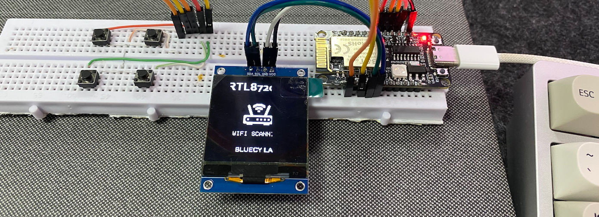

# Disclaimer
This is an **incomplete application**, intended solely for research and learning purposes. We do not create applications for malicious or disruptive purposes. Any misuse of the features of this module is strongly discouraged.

**For more question about creating, fixing, adding new feature to this repository, make sure you connect to my Tiktok account at @2.4guy (Bluecy Labs) or scan following QR code.**


# RTL8720DN BW16 with SH1107 OLED

## Introduction
This is a program that uses the AI Thinker BW16 module (RTL8720DN) combined with an OLED display driven by the SH1107 IC.

Most of the advance functions was `credited` from original example at [RTL8720dn-Deauther](https://github.com/tesa-klebeband/RTL8720dn-Deauther)

This program can:
- Scan all Wi-Fi networks in the 2.4GHz and 5GHz bands.
- Display a list including SSID and RSSI signal strength.
- Use a button to navigate through the list of scanned networks.
- Assess network security using tools like DeAuthentication, Clone, Sampling.



## Prerequisites
### Hardwares
- You need an RTL8720DN BW16 module (black).
- A 128x128 monochrome OLED display using the SH1107 IC.
- Pull-up buttons
- Wires
### Softwares
- Arduino IDE
- Library: Adafruit GFX, Adafruit_SH110x

### Wirings
You can use a breadboard or a test circuit board to connect the modules together.

| **RTL8720DN BW16**         | **SH1107**          |
|-----------------------|-----------------------|
| GND     | GND      |
| 5V      | VCC     |
| PA25      | SCL     |
| PA26      | SDA      |

| **RTL8720DN BW16**         | **Buttons**          |
|-----------------------|-----------------------|
| PB1     | Next Button    |
| PB2      | Previous Button      |
| PB3      | Select Button      |
| PA27      | Back Button      |
All buttons share `GND` pin with `RTL8720DN BW16` modules.

### Arduino IDE configuration
Include BW16 RTL8720DN to board management by adding following json to the `Additional board manager URLs`
```json
https://github.com/ambiot/ambd_arduino/raw/master/Arduino_package/package_realtek_amebad_index.json
```
Install `Realtek Ameba Boards` version `3.1.5`, this version is required to be running.

Go to `Tools > Standard Lin Enabled: Arduino_STD_PRINF` (this is required)

## Flash & Uploading
### Using Arduino IDE and source code
Make sure you have downloaded the source code to your personal computer and installed the necessary board and libraries.

Then, connect the `RTL8720DN BW16` module to your computer using a data-capable cable.

Ensure that the COM port and `Board > AI Thinker BW16(RTL8720DN)` are selected in the Arduino IDE.

Switch the module to upload mode:

    - Press and hold the BOOT button.
    - Press the RST button once.
    - Release the BOOT button.

Check the Serial Monitor window to see the following information displayed:
```bash
#calibration_ok:[2:19:11]
#####
```
Now hit `Upload` on Arduino IDE and wait until it completes.

### Using Webflash Tools
To be updated

## Usage
There are a total of 4 functional buttons:
- `Next Button`: Used to navigate forward through menus and change values within the selected input.
- `Previous Button`: Used to navigate backward through menus and change values within the selected input.
- `Select Button`: Used to confirm a selection, similar to pressing Enter or OK.
- `Back Button`: Used to return to the main menu.